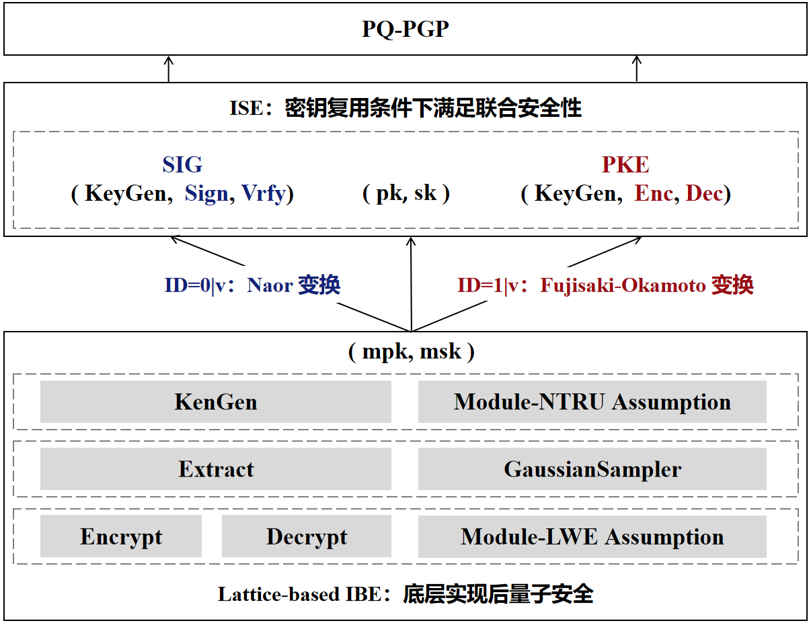
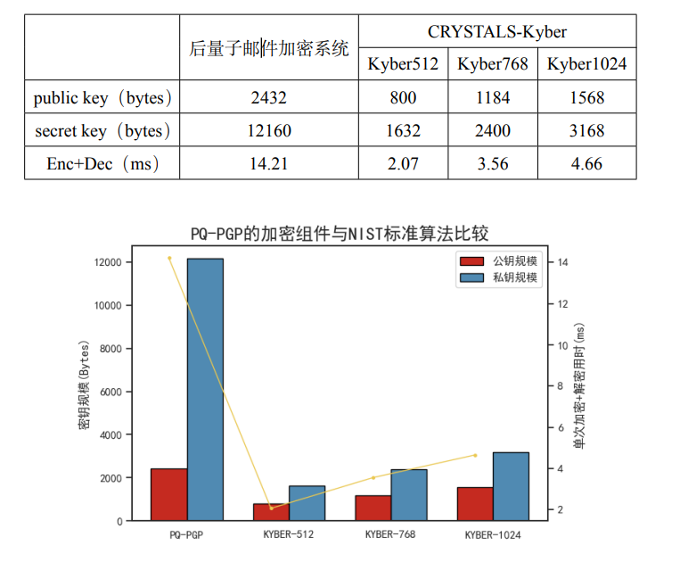

# 基于格密码和密钥复用的后量子邮件加密系统

详细原理及证明见附件[基于格密码和密钥复用的后量子邮件加密系统](https://github.com/Maxlsc/Projects-of-CSPIE/tree/main/Email%20encryption%20system%20based%20on%20post%20quantum%20cryptography%20and%20key%20reuse/src/Report.pdf)

## 本作品的工作

本作品采用上图所示的技术路线。主要工作如下：

（1）基于GPV方案[GPV08]，在Module-NTRU（MNTRU）格上实现了基于身份的加密系统IBE；

（2）基于PSST方案[PSST11b]，由IBE实现集成签名加密系统ISE；

（3）基于QT和C++，实现后端(1)(2)加密签名代码，同时编写用户操作友好的后量子PGP软件前端界面。

## 本作品的创新点

以下创新点均完成代码实现

### 密钥复用

本作品可以使用以下两种方案来实现后量子安全的PGP：

（1）采取密钥分离原则：直接用现有的NIST后量子密码算法标准代替现有PGP中使用的密码算法。

（2）采取密钥复用原则：现有NIST后量子密码算法标准中的加密算法 CRYSTALS-KYBER与签名算法CRYSTALS-DILITHIUM、FALCON 及 SPHINCS+ 的密钥结构均不同，无法自然地共用同一对密钥。若想实现密码复用原则，需要小心的构造。

为享有密钥复用原则带来的好处，本作品在这里采用第二种方案，设计实现了密钥复用的后量子PGP：后量子邮件加密系统。为实现密钥复用，本作品将Paterson 等人提出的基于IBE构造ISE的方案[PSST11]应用到MNTRU-IBE[CKKS19]上，得到支持密钥复用的后量子邮件加密系统系统。

本作品对IBE中的用户身份空间进行前缀划分，身份ID前缀为0，则通过Naor变换，转换为签名组件；身份ID前缀为1，则通过FO变换，转换为加密组件。对于每一个用户，都分别运行IBE的密钥生成算法，生成主密钥，用于加密组件和签名组件，实现了密钥复用，同时仍然满足联合安全性。

### 实现基于格的IBE

为了实现后量子安全，本作品使用格密码算法作为后量子邮件加密系统的底层。在格上实现IBE时，本作品以GPV方案[GPV08]为起点，对比分析了NTRU格和Module-NTRU格上的IBE算法，如下图：

经过综合比对后，本作品选择在效率更高的MNTRU上实现IBE作为底层设计。密钥生成算法KeyGen中，基于Module-NTRU假设，以MNTRU实例作为主公钥，接近正交的短格基$`T_{MNTRU}`$作为主私钥；用户密钥提取算法Extract中，在$`T_{MNTRU}`$上使用随机化最近平面算法，运行近似高斯采样器得到用户私钥；加密算法Encrypt和解密算法Decrypt则基于Module-LWE假设实现。

MNTRU格上的IBE可以在512维的多项上实现142bits安全，且相较于基于NTRU格87bits安全的构造相比，效率也有明显提升：密钥生成效率约提升1.7倍，加密和解密约提升3倍；与此同时，密钥规模也更小：主公钥规模由3328bits缩减为2432bits，用户私钥规模由2048bits缩减为1152bits。

## 效率对比

### 测试环境

| 操作系统 | Ubuntu20.04                               |
| -------- | ----------------------------------------- |
| CPU      | Intel(R) Core(TM) i7-12700H CPU @ 2.30GHz |
| 编译器   | GCC 9.4.0                                 |
| 内存     | 8GB                                       |

### 效率测试与比较

#### 性能测试

**与现有PGP算法比较**：在测试后量子邮件加密系统效率时，本作品与现有PGP中最广泛使用的前三种算法（RSA-4096、RSA-3072、RSA-2048）进行比较。测试单次加密+解密的用时，以及单次签名+签证的用时，并比较了各个算法的签名长度。测试结果如表：

在加解密速度和签名验签速度方面，本作品的后量子邮件加密系统与现有 PGP 流行的算法相比有很好的表现。如图3.2后量子邮件加密系统加密组件的速度约为 RSA-4096 算法的 8.04 倍，RSA-3072 算法的 3.90 倍，RSA-2048 算法的 2.54 倍；后 量子邮件加密系统签名组件的速度约为 RSA-4096 算法的 8.45 倍，RSA-3072 算法的 4.09 倍，RSA-2048 算法的 2.57 倍。由此可见，加密效率和签名效率均有大幅提升。 在签名规模方面，后量子邮件加密系统的签名算法相对于现有 PGP 流行的签名 算法来说，签名规模较大。

**与 NIST 后量子密码标准算法比较**：将后量子邮件加密系统与NIST 后量子密码标准算法（CRYSTALS-Kyber、CRYSTALSDilithium、Falcon 和 SPHINCS+）比较，测试结果如下图：

如上图所示，后量子邮件加密系统的加密组件与 NIST 后量子密码标准加密算法 CRYSTALS-Kyber 相比，密钥规模较大，加解密速度相较来说稍为逊色。

后量子邮件加密系统签名算法与 NIST 后量子密码标准签名算法相比，密钥规模和 Falcon 算法基本相当；签名尺寸除 Falcon 外，相较于 CRYSTALS-Dilithium 和 SPHINCS+ 算法均有较好的表现；签名和签证速度快于 SPHINCS+ 算法，约为其速度的 2 倍。

## 软件代码编译方法

将本项目下载至windows系统中，使用QT6.4.3版本的QT编译器（利用.pro文件直接导入即可）在release下编译即可生成软件可执行文件。

编译条件：

| 操作系统 | Windows系统 |
| -------- | ----------- |
| 编译器   | MSVC2019    |
| QT版本   | 6.4.3       |

## 软件效果预览

