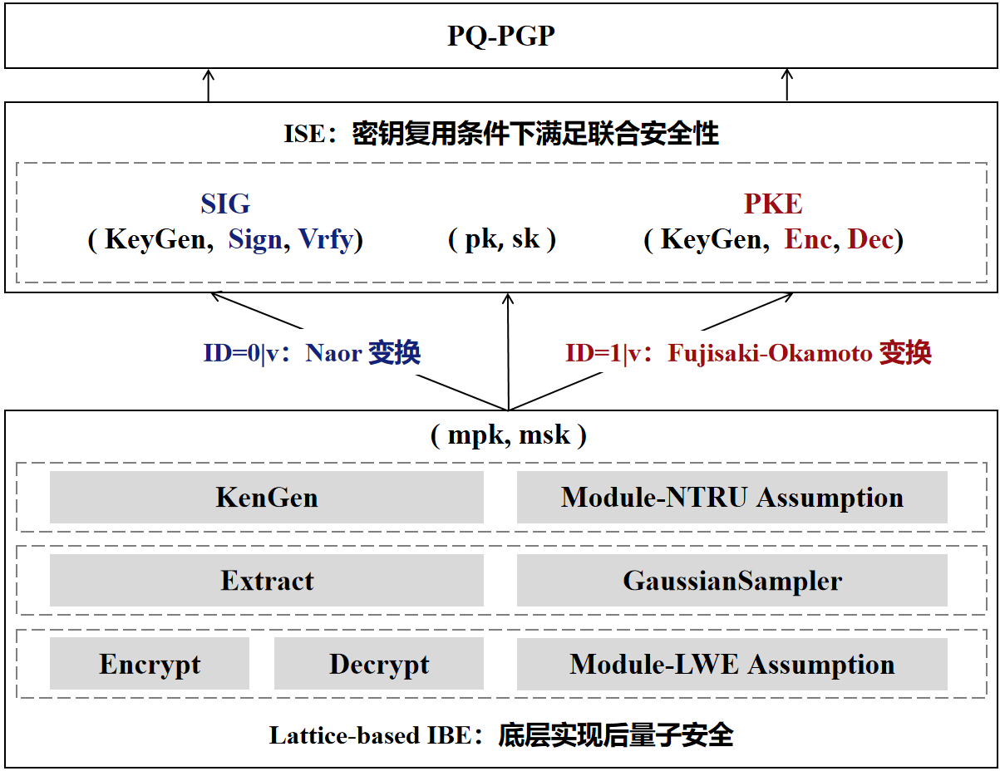
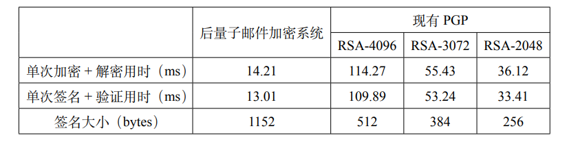

# Post-Quantum Email Encryption System Based on Lattice Cryptography and Key Reuse

[Chinese]([PQ-PGP/README.md at main · xin-li-sdu/PQ-PGP (github.com)](https://github.com/xin-li-sdu/PQ-PGP/blob/main/README.md))，[English](([PQ-PGP/README.md at main · xin-li-sdu/PQ-PGP (github.com)](https://github.com/xin-li-sdu/PQ-PGP/blob/main/english.md))

For detailed principles and proofs, please refer to the document [Post-Quantum Email Encryption System Based on Lattice Cryptography and Key Reuse](https://github.com/Maxlsc/Projects-of-CSPIE/tree/main/Email%20encryption%20system%20based%20on%20post%20quantum%20cryptography%20and%20key%20reuse/src/Report.pdf).

## The Work of This Project

This project adopts the technical route as shown in the above figure. The main work includes:

(1) Implementing an identity-based encryption system IBE on the Module-NTRU (MNTRU) lattice based on the GPV scheme [GPV08];

(2) Implementing an integrated signature encryption system ISE based on the PSST scheme [PSST11b] derived from IBE;

(3) Implementing the backend encryption and signature code for (1) and (2) based on QT and C++, and concurrently developing a user-friendly frontend interface for post-quantum PGP software.

## Innovations of This Project

The following innovations have been implemented in the code:

### Key Reuse

This project can achieve post-quantum secure PGP using the following two approaches:

(1) Adopting the principle of key separation: directly replace the existing PGP cryptographic algorithms with the NIST post-quantum cryptographic algorithms.

(2) Adopting the principle of key reuse: the encryption algorithm CRYSTALS-KYBER and the signature algorithms CRYSTALS-DILITHIUM, FALCON, and SPHINCS+ in the existing NIST post-quantum cryptographic algorithm standards have different key structures, making it challenging to naturally reuse the same key pair. Careful construction is required to achieve key reuse.

To leverage the benefits of key reuse, this project adopts the second approach and designs a post-quantum PGP: post-quantum email encryption system that supports key reuse. To achieve key reuse, this project applies the scheme proposed by Paterson et al. for constructing ISE based on IBE to MNTRU-IBE [CKKS19], allowing the creation of a post-quantum email encryption system that supports key reuse.

This project partitions the user identity space in IBE by prefix. When the identity ID prefix is 0, it undergoes Naor transformation to become a signature component; when the identity ID prefix is 1, it undergoes FO transformation to become an encryption component. For each user, the key generation algorithm of IBE is separately executed to generate a master key used for both encryption and signature components, achieving key reuse while still satisfying joint security.

### Implementation of Lattice-based IBE

To achieve post-quantum security, this project uses lattice cryptography as the foundation for the post-quantum email encryption system. When implementing IBE on a lattice, this project starts with the GPV scheme [GPV08] and compares and analyzes IBE algorithms on NTRU lattices and Module-NTRU lattices, as shown in the following figure:

After comprehensive comparison, this project chooses to implement IBE on the more efficient MNTRU as the underlying design. In the key generation algorithm KeyGen, based on the Module-NTRU assumption, the MNTRU instance is used as the master public key, and an almost orthogonal short lattice basis $`T_{MNTRU}`$ is used as the master private key; in the user key extraction algorithm Extract, randomized nearest plane algorithm is applied on $`T_{MNTRU}`$ to obtain the user's private key through approximate Gaussian sampler; the encryption algorithm Encrypt and decryption algorithm Decrypt are implemented based on the Module-LWE assumption.

IBE on the MNTRU lattice can achieve 142bits security on a 512-dimensional polynomial ring, which is more efficient compared to the construction based on NTRU lattice with 87bits security: the key generation efficiency is improved by about 1.7 times, and the encryption and decryption efficiency is improved by about 3 times; at the same time, the key sizes are also reduced: the master public key size is reduced from 3328 bits to 2432 bits, and the user private key size is reduced from 2048 bits to 1152 bits.

## Efficiency Comparison

### Test Environment

| Operating System | Ubuntu 20.04                              |
| ---------------- | ----------------------------------------- |
| CPU              | Intel(R) Core(TM) i7-12700H CPU @ 2.30GHz |
| Compiler         | GCC 9.4.0                                 |
| Memory           | 8GB                                       |

### Efficiency Testing and Comparison

#### Performance Testing

**Comparison with Existing PGP Algorithms**: When evaluating the efficiency of the post-quantum email encryption system, this project compared its performance with the three most widely used algorithms in existing PGP (RSA-4096, RSA-3072, RSA-2048). The testing includes the time taken for single encryption + decryption, single signing + verifying, and the signature length of each algorithm. The test results are as follows:

In terms of encryption/decryption speed and signature verification speed, the post-quantum email encryption system in this project performs well compared to the popular algorithms in existing PGP. As shown in Figure 3.2, the encryption component speed of the post-quantum email encryption system is approximately 8.04 times faster than RSA-4096, 3.90 times faster than RSA-3072, and 2.54 times faster than RSA-2048; the signature component speed of the post-quantum email encryption system is approximately 8.45 times faster than RSA-4096, 4.09 times faster than RSA-3072, and 2.57 times faster than RSA-2048. Therefore, both encryption and signature efficiency have been significantly improved. In terms of signature size, the signature algorithm of the post-quantum email encryption system has a larger signature size compared to the popular signature algorithms in existing PGP.

**Comparison with NIST Post-Quantum Cryptographic Standard Algorithms**: Comparing the post-quantum email encryption system with NIST post-quantum cryptographic standard algorithms (CRYSTALS-Kyber, CRYSTALS-Dilithium, Falcon, and SPHINCS+), the test results are as shown in the following figure:

As shown in the above figure, the encryption component of the post-quantum email encryption system has a larger key size compared to the NIST post-quantum cryptographic standard encryption algorithm CRYSTALS-Kyber, and its encryption/decryption speed is slightly inferior.

Comparing the signature algorithm of the post-quantum email encryption system with the NIST post-quantum cryptographic standard signature algorithms, the key size is comparable to the Falcon algorithm; in terms of signature size, except for Falcon, it performs better compared to CRYSTALS-Dilithium and SPHINCS+ algorithms; the signature and verification speed is faster than the SPHINCS+ algorithm, approximately twice as fast.

## Software Code Compilation Method

Download this project to a Windows system and compile it using the QT compiler version 6.4.3 (simply import the .pro file). Compile in the release mode to generate the executable software file.

Compilation requirements:

| Operating System | Windows  |
| ---------------- | -------- |
| Compiler         | MSVC2019 |
| QT Version       | 6.4.3    |

Note: Due to environmental issues, the OpenSSL and NTL libraries required for this project have been precompiled and integrated into the project files, eliminating the need for additional compilation.

## Software Preview:

